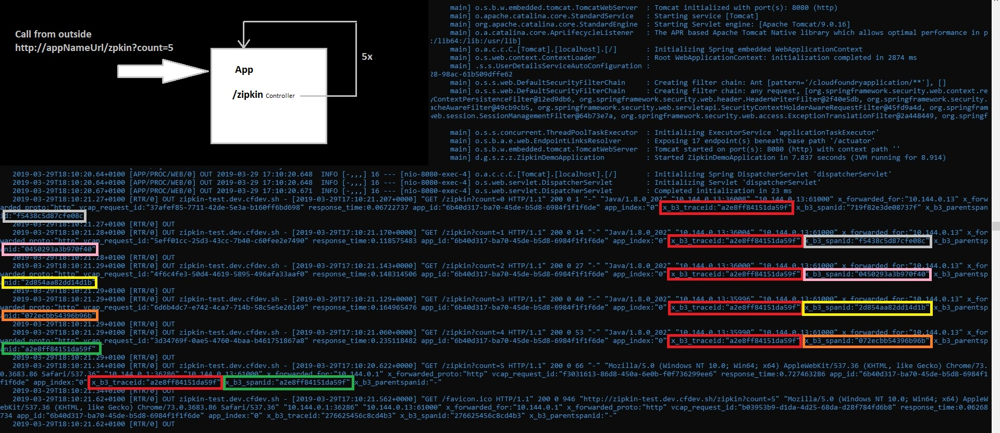

# Zipkin Client Example with Spring Boot 2 for Cloud Foundry

This project is to demonstrate how to create a RestTemplate based on java spring boot 2 so that it adds the zipkin headers for all http calls automatically.

You can find in the class <a href="./src/main/java/de/grimmpp/springboot/zipkindemo/zipkindemo/ZipkinController.java">ZipkinController</a> an example of a REST endpoint which starts a series of cascading calls when you trigger it. By calling the endpint /zipkin?count=5 you can trigger a cascade of 5 + the initial trigger call.
In the log output of Cloud Foundry you can see the log entries from the GoRouter (access logs) for each single call. In the log outout you will see the response of the last call first because they are nested. The trigger call is the last call in the list and at the bottom of the log stack. 

In the following picture you can see example logs which were caused by http://zipkin-test.dev.cfdev.sh/zipkin?count=5 .



## How to build
````
./gradlew clean build
```` 

## How to deploy
````
./deploy.bat
````
As part of the deployment you need to set the environment variable baseUrl=http://appurl.com so that the app knows where to send the next request.

## How to trigger app / generate logs
````
curl http://zipkin-test.dev.cfdev.sh/zipkin?count=5     #curl http://<APP_URL>/zipkin?count=<NUMBER_OF_CALLS>
````
